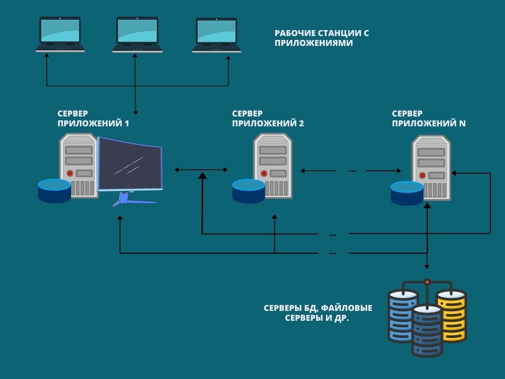

Client_Server

# 1. Клиент-серверная архитектура

Термин __«клиент-серверная архитектура»__ – сборное понятие, состоящее из двух взаимодополняющих компонентов: сервера и, собственно, клиента.

`Сервер`– очень мощный компьютер или специальное системное оборудование, которое предназначается для разрешения определенного круга задач по процессу выполнения программных кодов. Он выполняет работы сервисного обслуживания по клиентским запросам, предоставляет пользователям доступ к определенным системным ресурсам, сохраняет данные или БД.

***Параметры, которые могут реализоваться на стороне сервера:***
Хранение, защита и доступ к данным;
Работа с поступающими клиентскими запросами;
Процесс отправки ответа клиенту.

***Параметры, которые могут реализоваться на стороне клиента:***
Площадка по предоставлению пользовательского графического интерфейса;
Формулировка запроса к серверу и его последующая отправка;
Получение итогов запроса и отправка дополнительной группы команд (запросы на добавление, обновление информации,
 удаление группы данных).

__Разновидности клиент-серверной архитектуры__

Выделяют следующие типы архитектуры клиент серверов:

`Одноуровневая`;

`Двухуровневая;`

`Трехуровневая`;

`Многоуровневая.`

__Одноуровневая система__

Одноуровневая архитектура предполагает распределение прикладного ПО по отдельным рабочим единицам, обращающимися при взаимодействии к одному серверу. Здесь нет дополнительных программ. Сервер всего лишь предоставляет сведения в ответ на запрос.

Архитектура надежная, но в управлении достаточно сложная. Во всех рабочих станциях информация будет находиться в разных вариациях. А это значит, что на ряде аппаратного обеспечения потребуется выполнение синхронизации. Здесь же предусмотрен еще один уровень – базы данных. Те, кто не сильно вникает в теорию, воспринимают его за отдельный рабочий уровень и ошибочно принимают одноуровневую структуру двухуровневой.

__Двухуровневая система__

В двухуровневой архитектуре уже присутствуют прикладные программы. Они располагаются на специально выделенном сервере ПО. А вот программы-клиенты, предоставляющие пользовательский интерфейс для взаимодействия с приложениями, размещены в рабочих единицах. Это строение обладает большей логичностью. Здесь предусмотрено 2 варианта: толстый клиент и тонкий сервер или же тонкий клиент и толстый сервер. В первом случае информация хранится на сервере, а логика ее обработки и бизнес-файлы на машине-клиенте. Если же на сервере находятся и данные, и логика их обработки, то говорят о двухуровневой архитектуре тонкий клиент, толстый сервер.

Среди достоинств такого решения выделяют:

удобство работы;
простоту модификаций и конфигураций программных продуктов;
отличная производительность, возможность масштабирования.
Но надо знать, что при повышении количества клиентов, производительность системы может снижаться. Еще есть риск появления проблем с безопасностью, ведь вся информация и ПО хранятся на одной машине. А еще клиенты будут завязаны на БД одного производителя. Эти моменты относят к недостаткам двухуровневой архитектуры.

__Трехуровневая система__

Здесь центральный, файловый и другие разновидности серверного аппаратного обеспечения –особый уровень, предназначенный для обслуживания сервера приложений. В сфере предложений находится логика данных и бизнес-логика. Клиент связывается с БД не напрямую, а через специальное промежуточное ПО, размещенное на сервере приложений. Такое решение обеспечило повышение продуктивности взаимодействия и улучшило вариативность функционирования.

Технология клиент сервер с архитектурой третьего уровня имеет 3 ключевых достоинства:

абсолютная целостность потока;
отличный уровень защиты БД от доступа злоумышленников;
большая безопасность в сравнении с предыдущими вариантами.
Но наличие промежуточного ПО существенно усложняет структуру взаимосвязи между клиентом и сервером. А это уже – недостаток решения.

__Многоуровневая система__

Предполагается, что ряд серверов приложений в работе применяет результаты друг друга и данные из сторонних серверов. То есть трехуровневая – часть многоуровневой архитектуры. Среди достоинств выделяют повышенную гибкость оказываемых услуг, ведь они – результат работы отдельных дата-центров и их программных продуктов.

Недостаток очевидный – многокомпонентность, которая значительно усложняет архитектуру и сам процесс клиентского взаимодействия.

# 2. Что ткое HTTP и HTTPS

`Сетевой протокол`– это особый набор правил, на основании которого выполняется точное взаимодействие между компьютерами внутри виртуальной сети.

`HTTP (от англ. HyperText Transfer Protocol`— протокол передачи гипертекста) — это прикладной протокол передачи данных в сети. На текущий момент используется для получения информации с веб-сайтов. Протокол HTTP основан на использовании технологии «клиент-сервер»: клиент, отправляющий запрос, является инициатором соединения; сервер, получающий запрос, выполняет его и отправляет клиенту результат. Сейчас по HTTP передается не только гипертекст, но и другие данные: картинки, аудио, видео.

`HTTPS (от англ. HyperText Transfer Protocol Secure` — безопасный протокол передачи гипертекста) — это расширение протокола HTTP, поддерживающее шифрование посредством криптографических протоколов SSL и TLS. Он шифрует соединение по криптографическим протоколам: так клиент и сервер смогут безопасно передавать сообщения друг другу.

***Отличия HTTP от HTTPS:***

HTTPS не является отдельным протоколом передачи данных, а представляет собой расширение протокола HTTP с надстройкой шифрования;
передаваемые по протоколу HTTP данные не защищены, HTTPS обеспечивает конфиденциальность информации путем ее шифрования;
HTTP использует порт 80, HTTPS — порт 443.

# 3. HTTP методы

По протоколу HTTP фронтенд передаёт __запрос__ (request), а бэкенд - __ответ__ (response). 
Запрос структурирован по правилам передачи данных HTTP. Он состоит из трех блоков: стартовая строка, заголовки, тело сообщения. 

`Стартовая строка` (start line) состоит из трех элементов: метода, пути до ресурса и версии протокола. 
***Например:*** Post/search/HTTP/1.1 или GET / HTTP/ 1.1

`Путь до ресурса` - адрес, по которому фронтенд отправляет запрос на бэкенд. 

`Версия протокола` - Номер версии HTTP. Сейчас применяют версию HTTP/1.1.

`Тело сообщения` - это данные, которые передает фронтенд. (Форматы JSON, HML, текст...)

`Метод` (method) указывает действие: бэккенд принимает его в обработку.
HTTP определяет множество методов запроса, которые указывают, какое желаемое действие выполнится для данного ресурса. Несмотря на то, что их названия могут быть существительными, эти методы запроса иногда называются HTTP глаголами. Каждый реализует свою семантику, но каждая группа команд разделяет общие свойства: так, методы могут быть безопасными, идемпотентными или кешируемыми.

Самые распространенные:

`GET`
Метод GET запрашивает у бэкенда данные по определенному адресу. Метод характеризуют именно запросы информации от сервера, т.е. клиент просто отправляет какую-то информацию, запрашивает ее от сервера.

`HEAD`
HEAD запрашивает ресурс так же, как и метод GET, но без тела ответа.

`POST`
POST отправляет данные на бэкенд. В методе содержится основная часть - payload, например, в теле запроса, может быть какая-то картинка, либо текст, которые мы отправляем на сервер подобным способом.
 
__PUT__
Также действует метод PUT, тоже отправляется какая-то информация на сервер, обычно он используется для того, чтобы у нас создавался какой-то объект на сервере.

`DELETE`
Данный метод удаляет данные с сервера, либо с сервера базы данных.

***Отличия методов GET и POST:***

GET метод для чтения данных с сайта. Например, для доступа к указанной странице. Он говорит серверу, что клиент хочет прочитать указанный документ. На практике этот метод используется чаще всего, например, в интернет-магазинах на странице каталога. Фильтры, которые выбирает пользователь, передаются через метод GET.

GET-запросы лучше не использовать с приватной информацией. Вот почему:
- Они кэшируются. Это значит, что логин и пароль, переданные через GET-запрос, могут остаться в интернете навсегда, например, в веб-архиве или кэше Гугла.
- Остаются в истории браузера. Чтобы узнать, какие данные отправлялись, достаточно нажать Ctrl+H.
- Сохраняются в закладках и пересылаются. Можно не обратить внимания и опубликовать в соцсетях или отправить ссылку с приватной информацией в GET-запросе.
- Сохраняются в логах сервера. Например, нельзя отправлять данные банковских карт через GET-запрос, так как это создаёт риски для пользователей.

Таким образом, любые важные данные — логины, пароли, данные карты, персональные данные — лучше передавать с помощью метода POST. Также метод POST поддерживает тип кодирования данных multipart/form-data, что позволяет передавать файлы.

GET (Фильтры в интернет-магазинах, передача параметров через ссылку, другие безопасные запросы)
POST (Любые формы с паролями или банковскими картами, формы заявок с персональными данными, отправка файлов)

# 4. HTTP статус-коды сервера

`Код ответа сервера` (или код состояния HTTP) — это первые три цифры и фраза на английском языке, которые дают понять пользователю (браузеру), краулеру и поисковому роботу, как сайт отреагировал на запрос к определённой странице или документу.

Существует пять основных групп - это 100, 200, 300, 400 и 500. 

`100` - информационные сообщения;

`200` - сообщения об успехе операций;

`300` - сообщение о перенаправлении;

`400` - ошибки на стороне клиента;

`500` - ошибки на стороне сервера; 

Тестировщиков, в первую очередь интересуют коды 200, 400 и 500, так как они говорят о том, что у нас происходит, какие-то критические ошибки.

`200` - Основной код, который говорит о том, что все прошло успешно как на стороне клиента, так и на стороне сервера. Т.е. сервер обработал наш запрос от клиента, дал на него ответ.

`300` Говорит о том, что информацию нам сервер вернул в ответе, однако, он нашел ее в другом месте, здесь нас будет интересовать такой код, как 301 - т.е. клиент обратился к какой-то странице, однако данная страница перемещена и находится по новому адресу. Стоит всегда обращать на такие ошибки внимание, потому что это потенциальные угрозы, у нас не всегда может содержаться информация о новом адресе нашего ресурса, т.е. она может просто куда-либо пропасть, и тогда 301 ошибка может перерасти в более серьезную ошибку, например в 404.

`400` Это ошибки на клиенте. Такая ошибка говорит о том, что запрос не смог быть обработан сервером, он был составлен неверно, и в случае такой ошибки необходимо обязательно скопировать всю информацию о данном запросе в баг-репорт, чтобы разработчик, получив информацию о данном отчете, о данном дефекте, смог без труда понять, в чем кроется основная причина данного бага. 

`500` - если мы видим эту ошибку, то нужно обязательно завести баг - critical или blocker, т.е. в данном случае что-то произошло на сервере, какая-то фатальная ошибка, которая не позволяет ему ответить на ваш запрос, поэтому это очень серьезно для программного обеспечения.

# 5. Что такое ядро браузера 

`Ядро браузера` можно разделить на две части: движок рендеринга (инженер макета или движок рендеринга) и движок JS. 
Он отвечает за получение содержимого веб-страницы (HTML, XML, изображения и тд), организацию инфрмации (направление, добавление CSS и тд) и 
расчет режима отображения веб-страницы, а затем вывод ее на монитор и принтер. 
Разница в ядре браузера будет по-разному интерпретировать синтаксис веб-страницы, поэтому эффект рендеринга будет другим. 
Ядра браузера можно разделить на пять типов: Trident, Gecko, Presto, Webkit, Blink.

# 6. Какие браузеры какие ядра используют

__Trident__ - IE 9 и ниже

__Gecko__ - Firefox

__Presto__ - Opera 12.17 и ниже и сейчас не используется

__Blink__ - Chrome, Opera, Microsoft Edge

__WebKit__ - Safari 

# 7. Что такое API

`API` (Application Programming Interface)— программный интерфейс приложения, или интерфейс программирования приложений) — специальный протокол для взаимодействия компьютерных программ, который позволяет использовать функции одного приложения внутри другого.

# 8. Что такое эндпоинты
`Эндпоинт` (Endpoint - конечная точка) — это само обращение к маршруту отдельным HTTP методом. 
Эндпоинт выполняют конкретную задачу, принимают параметры и возвращают данные Клиенту.

Каждый api-сервис имеет endpoint, к которому и нужно обращаться, например отправлять http-запрос. Обычно это url. 
Т.о. endpoint - это url. Или такая. url включает в себя маршрут (основная часть адреса сервиса) и endpoint (часть url, 
которая содержит например имя вызываемого метода). Существует один маршрут и у него несколько эндпоинтов. Т.о. здесь endpoint - это только часть url.

# 9. URL (URI, URL, URN)
Расшифровка аббревиатур
`URL`- Uniform Resource Locator (унифицированный определитель местонахождения ресурса)
`URN` - Unifrorm Resource Name (унифицированное имя ресурса)
`URI` - Uniform Resource Identifier (унифицированный идентификатор ресурса)
Внимание! Далее в мелочах кроется истина, и пока ничего не понятно, - какая-то каша, но, едем дальше.

***В чем различия:***

__URL__: Исторически возник самым первым из понятий и закрепился как синоним термина веб-адрес. URL определяет местонахождение ресурса 
в сети и способ его (ресурса) извлечения.
Это позволяет нам полностью узнать: как, кому и где можно достать требуемый ресурс, вводя понятия схемы, данных авторизации и местонахождения.

__URN__: Неизменяемая последовательность символов определяющая только имя некоторого ресурса. Смысл URN в том, что им единоразово и 
уникально именуется какая-либо сущность в рамках конкретного пространства имен (контекста), либо без пространства имен, 
в общем (что не желательно). Таким образом, URN способен преодолеть недостаток URL связанный с возможным будущим изменением и перемещением ссылок,
однако, теперь для того, чтобы знать местонахождение URN ресурса необходимо обращаться к системе разрешения имен URN, в которой он должен быть зарегистрирован.

__URI__: Это лишь обобщенное понятие (множество) идентификации ресурса, включающее в нашем случае как URL, так и URN, как по отдельности, так и совместно. 
Т.е. мы можем считать, что: URI = URL или URI = URN или URI = URL + URN

***Подведем итоги***:

URI - это абстракция концепции идентификации,
а URL и URN - это конкретные реализации - полного адреса ресурса и уникального контекстного имени соответственно.

# 10. Идемпотентные HTTP методы

Метод HTTP является идемпотентным, если повторный идентичный запрос, сделанный один или несколько раз подряд, имеет один и тот же эффект, не изменяющий состояние сервера. Другими словами, идемпотентный метод не должен иметь никаких побочных эффектов (side-effects), кроме сбора статистики или подобных операций. Корректно реализованные методы __GET, HEAD, PUT и DELETE__ идемпотентны, но не метод POST. Также все безопасные методы являются идемпотентными.

#  11. Безопасные HTTP методы

Метод HTTP является безопасным, если он не меняет состояние сервера. Другими словами, безопасный метод проводит операции "только чтение" (read-only). Несколько следующих методов HTTP безопасные: __GET, HEAD или OPTIONS.__ Все безопасные методы являются также идемпотентными, как и некоторые другие, но при этом небезопасные, такие как PUT или DELETE.

Даже если безопасные методы являются по существу "только для чтения", сервер всё равно может сменить своё состояние: например, он может сохранять статистику. Что существенно, так то, когда клиент вызывает безопасный метод, то он не запрашивает никаких изменений на сервере, и поэтому не создаёт дополнительную нагрузку на сервер. Браузеры могут вызывать безопасные методы, не опасаясь причинить вред серверу: это позволяет им выполнять некоторые действия, например, предварительная загрузка без риска. Поисковые роботы также полагаются на вызовы безопасных методов.

Безопасные методы не обязательно должны обрабатывать только статичные файлы; сервер может генерировать ответ "на-лету", пока скрипт, генерирующий ответ, гарантирует безопасность: он не должен вызывать внешних эффектов, таких как формирование заказов, отправка писем и др.

# 12. Идентификация, Аутентификация, Авторизация

`Идентификация` — процедура, в результате выполнения которой для субъекта идентификации выявляется его идентификатор, однозначно определяющий этого субъекта в информационной системе.

`Аутентификация` — процедура проверки подлинности, например проверка подлинности пользователя путем сравнения введенного им пароля с паролем, сохраненным в базе данных.
Авторизация — предоставление определенному лицу или группе лиц прав на выполнение определенных действий.

# 13. Что такое IP
`IP` (Internet Protocol)-адрес – это уникальный идентификатор сетевого узла в публичной или частной компьютерной сети, 
которая построена на базе стека протоколов TCP/IP. Это адрес компьютера, сервера или ещё какого-нибудь сетевого оборудования. 
Служит для того, чтобы упорядочить устройства в сети. Что-то вроде адреса на карте (страна, область, город, улица, дом) или телефонного номера. 
Нужно же понимать, кому отправляете посылку/письмо или дозваниваетесь, верно? Вот в компьютерных сетях для идентификации любых сетевых узлов используются IP-адреса, 
чтобы было понятно, куда отправлять запрос, откуда он пришёл, где находится узел, к чему относится и т. д.

`IP-адрес` – это строка чисел, разделенных точками. IP-адреса представляют собой набор из четырех чисел, например, 192.158.1.38. Каждое число в этом наборе принадлежит интервалу от 0 до 255. Таким образом, полный диапазон IP-адресации – это адреса от 0.0.0.0 до 255.255.255.255.

IP-адреса не случайны. Они рассчитываются математически и распределяются __Администрацией адресного пространства Интернета__ (Internet Assigned Numbers Authority, IANA), подразделением Корпорации по присвоению имен и номеров в Интернете (Internet Corporation for Assigned Names and Numbers, ICANN). 

# 14. Что такое октеты в DNS

`Domain Name System` - служит для преобразования имени ресурса в IP адрес.
`Октет` - 8 битная секция IP адреса.
`Октет` - это диапазон чисел от 0 до 255, составляющих часть IP адреса. Октеты в IP разделены точкой.	Например в IP: 192.168.1.1 Первая октета будет - 192, вторая октета - 168.

# 15. Что такое порт, сколько портов у Linux сервера
`Порт` - это просто целое число на пакете данных, который показывает, для какой программы 
эти данные предназначены.
На данный момент существует определенное число портов – 65 535.

# 16. Уровни OSI

__1__ - `Физический уровень:` определяет метод передачи данных, какая среда используется (передача электрических сигналов, световых импульсов или радиоэфир), уровень напряжения, метод кодирования двоичных сигналов.

__2__ - `Канальный уровень:` он берет на себя задачу адресации в пределах локальной сети, обнаруживает ошибки, проверяет целостность данных. MAC-адреса и протокол «Ethernet», располагаются на этом уровне.

__3__ - `Сетевой уровень:` этот уровень берет на себя объединения участков сети и выбор оптимального пути (т.е. маршрутизация). Каждое сетевое устройство должно иметь уникальный сетевой адрес в сети. Например протоколы IPv4 и IPv6 работают на данном уровне.

__4__ - `Транспортный уровень:` этот уровень берет на себя функцию транспорта. Когда что-то скачивается по сети, файл в виде сегментов отправляется на локальный компьютер. Также здесь вводятся понятия портов, которые нужны для указания назначения к конкретной службе. На этом уровне работают протоколы TCP и UDP.

__5__ - `Сеансовый уровень:` на этом уровне происходит установление, управление и разрыв соединения между двумя хостами. К примеру, когда мы открываем страницу на веб-сервере, то мы не единственные посетители на нем. И вот для того, чтобы поддерживать сеансы со всеми пользователями, нужен сеансовый уровень.

__6__ - `Уровень представления:` он структурирует информацию в читабельный вид для прикладного уровня. Например, многие компьютеры используют таблицу кодировки ASCII для вывода текстовой информации или формат jpeg для вывода графического изображения.

__7__ - `Прикладной уровень:` на этом уровне работают привычные для нас приложения — почтовые и игровые клиенты, браузеры по протоколу HTTP, FTP и остальное.

# 17. Хедеры http запросов

Заголовки HTTP являются основной частью HTTP-запросов и ответов. Представляют собой пары ключ:значение и несут информацию о браузере клиента, запрошенной странице, сервере и многом другом.
Заголовки HTTP позволяют клиенту и серверу отправлять дополнительную информацию с HTTP запросом или ответом. 
В HTTP-заголовке содержится не чувствительное к регистру название, а затем после (:) непосредственно значение. Пробелы перед значением игнорируются.

